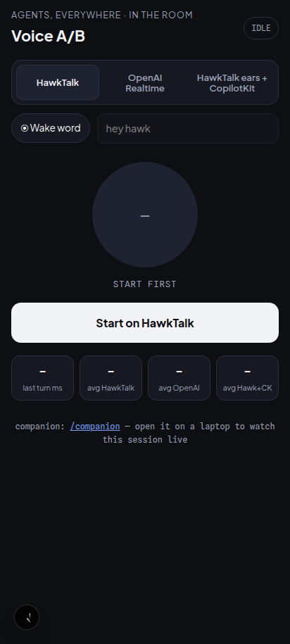
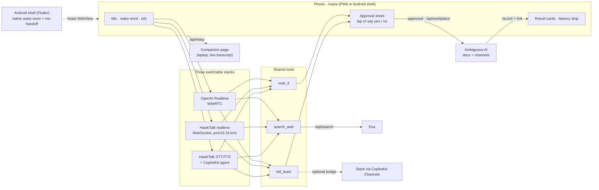

# Hey Hawk — a voice agent on the phone in your hand

**Say "hey hawk", ask out loud, get an answer out loud — and nothing gets written to your team's workspace until you say yes.**

Built at AI Tinkerers **Agents, Everywhere** (Seattle, 2026-09-12) on the official [CopilotKit starter kit](README-starter-kit.md).

<p align="center"></p>

It searches the web (Exa), files a note as an Ambiguous AI document, or posts to your team's Ambiguous channel. Before any write it shows the exact text on an approval sheet; tap, or say yes or no. The next card shows the record Ambiguous returned, with a link.

## Try it in 60 seconds

```bash
git clone https://github.com/barrhawk/aitinkerershackathonagentseverywhere-hawktalkpal hey-hawk && cd hey-hawk
npm ci
cp .env.example .env     # set OPENAI_API_KEY (Realtime access) and EXA_API_KEY
npm run dev:web          # open http://127.0.0.1:3100/voice
```

Pick **OpenAI Realtime**, press **Start**, and ask "what's the weather in Seattle right now?". The HawkTalk stacks and Ambiguous writes need their own keys (see [Environment](#environment)).

## One page, three voice stacks

Same prompt, same tools, same approval sheet, and a per-turn clock (end of speech to first sound) on every one:

| Stack | Hears | Thinks | Speaks |
|---|---|---|---|
| **OpenAI Realtime** | OpenAI (WebRTC, server VAD) | OpenAI Realtime | OpenAI |
| **HawkTalk** | HawkTalk STT | HawkTalk models on HawkTalk silicon (realtime WebSocket) | HawkTalk realtime voice |
| **HawkTalk ears + CopilotKit agent** | HawkTalk STT | the kit's CopilotKit agent (`MODEL_PROVIDER`: OpenAI or OpenRouter) | HawkTalk Chatterbox voice tier |

Tools on every stack: `search_web` (Exa), `note_it` (Ambiguous document), `tell_team` (Ambiguous channel message, optionally bridged to Slack via CopilotKit Channels). Latency method and measurements: [docs/latency.md](docs/latency.md).

## Architecture



Full walkthrough: [submission/architecture.md](submission/architecture.md).

## What runs on this build

Every stack has completed live spoken turns on 2026-09-12 (phone and laptop). Verified at the routes on the same day: Exa search, Ambiguous document create, Ambiguous channel post, HawkTalk STT/TTS, OpenAI ephemeral token, CopilotKit agent run with streaming reply. `npm run verify` (typecheck + the kit's offline tests) passes.

## Layout

- `apps/web/src/app/voice/` — the phone-first page (orb, stack switcher, wake chip, stat strip, transcript, result cards, approval sheet).
- `apps/web/src/lib/hawktalk-realtime.ts` — HawkTalk realtime client (OpenAI-dialect websocket, STT-first, ducking, barge-in, silent-mic guard).
- `apps/web/src/lib/hawk-rest.ts`, `lib/wake-word.ts` — turn recorder, TTS playback, browser wake word + endpointer.
- `apps/web/src/components/voice-tools.tsx` — the three tools as CopilotKit `useFrontendTool`s for the third stack.
- `apps/web/src/app/api/` — `hawktalk-config`, `hawk/stt`, `hawk/tts`, `workplace` (Ambiguous), `search` (Exa), `realtime-token` (OpenAI), `relay` (companion page feed), `copilotkit` (runtime).
- `apps/web/src/app/companion/` — laptop page that watches the phone's transcript, tool calls and approvals live.
- `apps/android-shell/` — Flutter wrapper: WebView + native wake word + mic handoff ([README](apps/android-shell/README.md)).
- `submission/` — description, architecture, video shot list, social post. `docs/` — screenshot, latency table.

## Environment

Node 22+. Lockfile committed. `npm run verify` runs the typecheck and the kit's offline tests. Every variable below is read by the code; `.env.example` has the same list with comments.

```bash
# OpenAI Realtime stack + Exa search — enough for a live voice turn with search_web
OPENAI_API_KEY=            # needs Realtime access
# NEXT_PUBLIC_REALTIME_MODEL=   # optional; leave commented unless set (empty overrides the default), default gpt-realtime-2.1
# NEXT_PUBLIC_REALTIME_VOICE=   # optional; leave commented unless set (empty overrides the default), default marin
EXA_API_KEY=
EXA_SEARCH_TYPE=fast
MODEL_PROVIDER=openai      # third stack's reasoning model (openai | openrouter)
MODEL=gpt-5.4-mini           # fastest measured for voice: ~0.5 s to first token vs 0.7–2.1 s for gpt-5.6-sol
OPENROUTER_API_KEY=        # only if MODEL_PROVIDER=openrouter

# HawkTalk stacks (account-dependent)
HAWKTALK_API_KEY=
HAWKTALK_REALTIME_URL=wss://api.hawktalk.ai/v1/realtime
HAWKTALK_API_URL=https://api.hawktalk.ai
HAWKTALK_STT_MODEL=hawk-ear
HAWKTALK_TTS_MODEL=chatterbox
HAWKTALK_VOICE=warm_us_female_support

# Ambiguous writes (account-dependent): a REST bearer, or a service-auth token file outside the repo
AMBIGUOUS_API_KEY=
AMBIGUOUS_TOKEN_FILE=/absolute/path/ambiguous-token.json
AMBIGUOUS_CHANNEL=general
```

## Demo script

Pick a stack, press **Start**, hold the orb and talk (HawkTalk stacks) or just talk (OpenAI, server VAD). Turn on **Wake word** and say "hey hawk" for hands-free.

1. "Hey hawk, what's the weather in Seattle right now?" → `search_web`, spoken answer.
2. "Note that the Realtime key is pending." → approval sheet → **Approve** or say "yes" → result card with the document link.
3. "Tell the team the demo is at four." → approval sheet → **Decline** or say "no" → nothing is written.
4. Tap the orb while it speaks → barge-in.

### Phone

The mic needs HTTPS. Put any HTTPS terminator in front of `127.0.0.1:3100` (mkcert + Caddy/nginx, `tailscale serve`, a self-signed proxy) and open `https://<host>/voice` on the phone; **Add to Home screen** gives you the PWA (wake lock, haptics, offline state). Or build the Android shell for the native wake word.

`api/hawktalk-config` hands the HawkTalk key to the browser (the socket authenticates in the websocket subprotocol), so it only answers on loopback, LAN, tailnet, or hosts listed in a `.public-hosts` file at the repo root. Use a demo key and rotate it after.

## House rules baked in

- **Ducking, not echo cancellation**: the mic is captured raw and attenuated to 8% while the agent speaks, never muted, so barge-in registers.
- **A silent capture is an error, not a guess**: if the mic delivers silence (muted, wrong device, another app holds it) the page says so instead of sending it to a model.
- **Writes are gated**: nothing reaches Ambiguous without the sheet; a spoken "yes" is only accepted after the request, never from the sentence that made it.

## Inherited vs built

Base commit `5c8bf4c` is the official starter kit, unmodified. Everything after it on this branch was written during the event (see `git log 5c8bf4c..HEAD` and `git diff --shortstat 5c8bf4c HEAD`; at submission time roughly 30 commits touching about 70 files): the three-stack voice page and shell, the HawkTalk realtime and REST clients, wake word + endpointer, approval queue and spoken decisions, Ambiguous workplace routes with service-auth renewal, the companion page and relay, generative-UI record cards, the CopilotKit Channels Slack bridge, the PWA, and the Android shell.

Inherited and reused as-is: the OpenAI Realtime token route, the Exa search route, `packages/agent-core` and the CopilotKit runtime.

No credentials are in the repo. Sample data: none; every record shown is one the workspace API returned.
