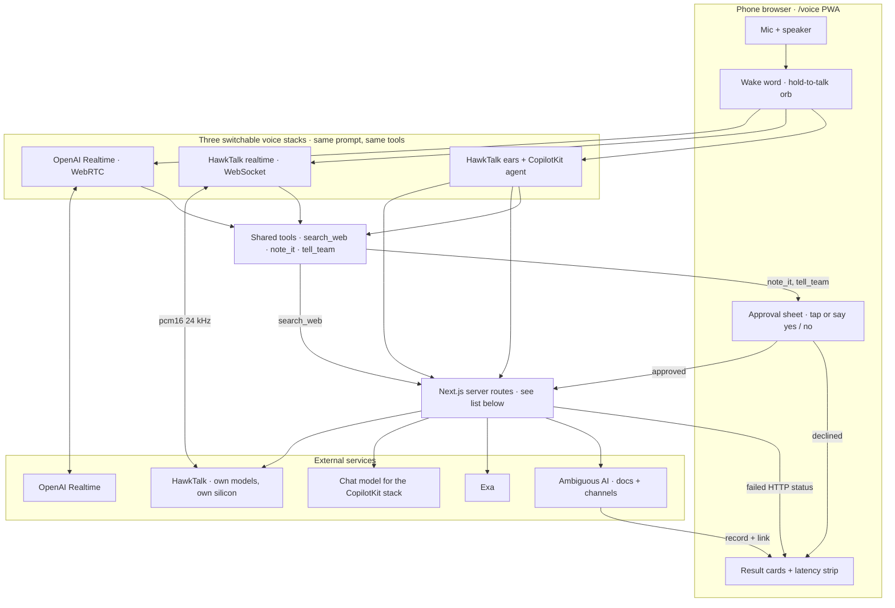

# Architecture — Voice A/B: one agent, three voice stacks, on a phone

The user is a person at an event with only a phone: on a table, hands busy, room loud, no laptop. Across all three stacks the agent is the same — same prompt, same three tools (Exa search, note to Ambiguous, message to an Ambiguous channel), same approval sheet before every write. The only thing that changes is the voice transport: OpenAI Realtime over WebRTC, HawkTalk realtime over WebSocket (HawkTalk's own models on its own silicon), or HawkTalk ears with the kit's CopilotKit agent reasoning. The phone measures end of speech to first sound for each stack and shows the numbers in the room.

What is lost if the context is removed: without the phone-in-a-venue context the wake word, pre-roll, ducking, barge-in, haptics, wake lock and offline state are decoration. With it they are the product — the phone has to hear you over the room, open a turn without a hand on it, tell you by vibration that it heard, and keep working when the venue Wi-Fi drops.

Server routes (`apps/web/src/app/api`): `realtime-token` (short-lived OpenAI client secret), `hawktalk-config` (HawkTalk WebSocket endpoint + demo key, private hosts only), `hawk/stt` and `hawk/tts` (HawkTalk speech in and out, key server-side), `copilotkit` (the kit's runtime), `search` (Exa), `workplace` (Ambiguous doc + channel message, deep links), and `lib/server/ambiguous-auth.ts` (credential resolution and renewal).

## How it fits together

1. The phone page (`apps/web/src/app/voice/page.tsx`) owns the mic, the orb, the wake word and the approval sheet; it is installable as a PWA, holds a wake lock while live, vibrates on turn edges, and shows an offline pill and disables connect when the network drops.
2. Turn control differs by stack. On the two HawkTalk stacks a turn opens by holding the orb or by saying the wake phrase, the endpointer closes it on silence, and a ~1.2 s pre-roll buffer keeps the words said before capture started. On OpenAI Realtime the orb is disabled: the WebRTC mic is always open, server VAD closes the turn, and in wake-word mode the mic is muted until the phrase is heard, then unmuted (no pre-roll).
3. The user picks one of three stacks before connecting: OpenAI Realtime over WebRTC (the kit's session), HawkTalk realtime over a plain WebSocket speaking the same event dialect with 24 kHz pcm16 both ways, or "HawkTalk ears + CopilotKit agent", where HawkTalk transcribes and speaks over REST and the kit's CopilotKit agent does the reasoning.
4. All three stacks get the same system prompt (`VOICE_RULES`, built on the kit's `SYSTEM_PROMPT`) and the same three tools: `search_web` (Exa), `note_it` (Ambiguous doc) and `tell_team` (Ambiguous channel message). In the CopilotKit stack they are `useFrontendTool` registrations (`components/voice-tools.tsx`); in the other two they are realtime function calls.
5. Every write passes through one page-level gate: the approval sheet shows exactly what will be filed, and the user approves or declines with a tap or a spoken yes / no on whichever stack is live. Decline returns "The user declined. Do not retry unless asked." to the model and lands as a declined card — the cancel path.
6. Failure path: a non-2xx from Ambiguous, a missing credential, or an unreachable HawkTalk (STT/TTS routes return 502) lands as a "failed (status)" card with the HTTP status, never a silent retry; a turn on a dead gateway leaves the stat strip without a number rather than inventing one.
7. Credentials: Exa, Ambiguous, OpenAI and HawkTalk STT/TTS keys stay on the server; OpenAI gets a short-lived client secret. Exception, stated plainly: the HawkTalk realtime stack hands a demo-scoped HawkTalk API key to the browser via `/api/hawktalk-config`, and the client puts it in the WebSocket subprotocol. That route only answers on loopback, LAN and tailnet hosts, and the key is rotated after the event.
8. `/api/workplace` calls Ambiguous, resolves a channel name to its UUID, attaches a deep link to the returned record, and the page renders it as a result card with "Open in Ambiguous". `ambiguous-auth.ts` uses `AMBIGUOUS_API_KEY` if set; otherwise it reads a token file and renews on demand via the jwt-bearer grant when the hour-long access token is within 120 s of expiry.
9. The latency strip shows the last turn, per-stack averages and a delta line. The clock anchors differ per stack: HawkTalk WebSocket measures commit to first audio delta; OpenAI measures the server `speech_stopped` event to first audio delta; the CopilotKit stack measures orb release to audio actually playing. The delta line compares HawkTalk vs OpenAI only; the CopilotKit stack gets an average but no delta.
10. Ducking, never AEC — on the two HawkTalk stacks: the mic is opened with `echoCancellation: false`, and while the agent speaks the path that reaches the recorder is attenuated (gain 0.08) but never muted; the raw level drives the meter and the endpointer. Barge-in fires on orb press or wake-word fire and cancels playback. The OpenAI stack uses the SDK's WebRTC audio path unchanged (browser AEC, server VAD).
11. In progress at time of writing, not in git: a live relay feeding a laptop companion page, and a CopilotKit Channels bridge so `tell_team` can also post to Slack via the kit's long-running `apps/channel` listener.

## Account-dependent behaviour and required environment

- `tell_team` posts to `AMBIGUOUS_CHANNEL`, defaulting to a channel named "general"; if no channel matches the name it falls back to the first channel in the workspace.
- The Ambiguous credential is `AMBIGUOUS_API_KEY`, or a token file at `AMBIGUOUS_TOKEN_FILE` written by an out-of-repo claim poller. The file default in `ambiguous-auth.ts` is a path under the developer's home directory; set `AMBIGUOUS_TOKEN_FILE` on any other machine.
- The two HawkTalk stacks need a HawkTalk account. `.env.example` has no `HAWKTALK_*` entries; set them yourself.
- Required environment: `OPENAI_API_KEY` (with Realtime access), `EXA_API_KEY`, `AMBIGUOUS_API_KEY` or `AMBIGUOUS_TOKEN_FILE`, `AMBIGUOUS_CHANNEL` (optional, default "general"), `HAWKTALK_API_KEY`, `HAWKTALK_API_URL` (default `https://api.hawktalk.ai`), `HAWKTALK_REALTIME_URL` (default `wss://hawktalk.ai/v1/realtime`), `HAWKTALK_VOICE` (optional), `HAWKTALK_STT_MODEL` and `HAWKTALK_TTS_MODEL` (optional). Demo data in the video is sample data.

## Inherited vs built during the event

Inherited from the CopilotKit starter kit (base commit `5c8bf4c`): `apps/web/src/app/voice/page.tsx` as a 167-line OpenAI-Realtime-only voice page with `search_web` and a transcript (rewritten during the event: 492 added, 132 removed), `SYSTEM_PROMPT`, the Exa `/api/search` route, the `/api/realtime-token` route, the CopilotKit runtime route, the kit's workplace capability (`packages/agent-core/src/capabilities/workplace.ts`, `apps/web/src/lib/server/workplace.ts`), `components/generative-ui.tsx`, and the `apps/channel` app.

Built on the `hawktalk-ab` branch during the event (7 commits, 18 files): the HawkTalk WebSocket stack (`lib/hawktalk-realtime.ts`), the HawkTalk-ears + CopilotKit stack (`lib/hawk-rest.ts`, `components/voice-tools.tsx`), the three-way switcher, `note_it` and `tell_team`, the approval sheet with spoken yes/no, the wake word and endpointer (`lib/wake-word.ts`), the latency clock and stat strip, ducking and barge-in, wake lock, haptics, offline state, the PWA manifest/icons/service worker, `/api/workplace` (a new route; it does not use the kit's workplace lib), `/api/hawk/stt`, `/api/hawk/tts`, `/api/hawktalk-config`, `lib/server/ambiguous-auth.ts`, and `voice.css`.

Status at submission: all three stacks completed live spoken turns on 2026-09-12; Exa search, Ambiguous document + channel writes, HawkTalk STT/TTS and the kit's verify suite verified at the routes the same day.
